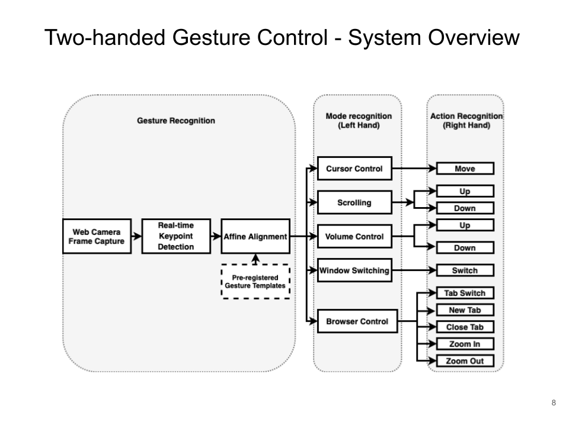
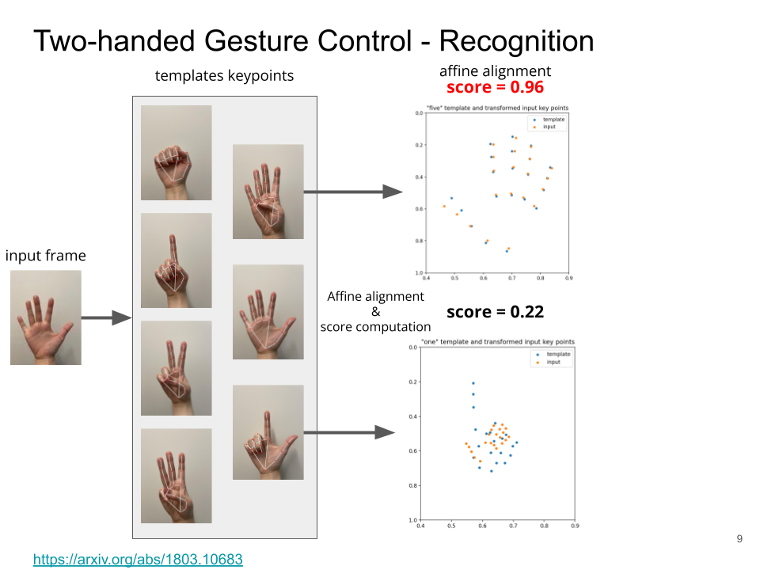

# Two-handed Gesture Mapping
An computer control application that allows cursor browsing, clicking, volume control, broswer control etc. by showing predefined hand gestures in front of the web camera

## System Overview

## Gesture Mapping

| Left Hand| Right Hand | Command |
| ----------- | ----------- | -----------|
| 1 |  N/A | cursor moving |
| 1 | Arrow | cursor: click|
| 1 | 2 | cursor: double click|
| 1 | 1 | cursor: right click|
| 2 | 1 | scroll: up|
| 2 | Arrow | scroll: down|
| 3 | 1 | volume: up|
| 3 | Arrow | volume: down|
| 3 | 2 | volume: mute|
| 4 | 1 | window: switch to previous app|
| 4 | 2 | window: browse windows|
| 4 | 3 | window: minimize active window|
| 5 | 1 | safari: new tab|
| 5 | 2 | safari: address bar|
| 5 | 3 | safari: close tab|
| 5 | 4 | safari: decrease text size|
| 5 | 5 | safari: increase text size|
| 5 | Arrow | safari: close tab|

## How To Run
Run the main python script *two_handed_mediapipe_spring.py*

For now the main script does not contain affine alignment recognition method, using keypoint distance calculation instead.

## Affine Alignment Gesture Recognition

*gesture_mapping* folder contains all the functions and templates.

To check the method:
1. run *static_recognition.py*: an example of image gesture recognition
2. run *video_recognition.py*: an example of streaming left-hand gesture recognition

`input_image` folder: example images that act as user streaming input

`input_data` folder: extracted 2D keypoints from input_images

`temp_data` and `tmp_data` folders: extracted 2D keypoints from `templage_image`, the pre-defined gestures (be sure that when you generate keypoints, don't use annotated images)

`template_image_annotated_new` folder: shows the extracted keypoints from template images

## To-do
1. merge affine alignment method to the main control scheme
2. improve the affine alignment method: more templates with various gestures and angles; try to incorporate 3D data to the method
3. improve the overall performance: cursor movement, control error tolerance etc.
4. simplify the way to use the application, by improving the gesture mapping logic or UI

